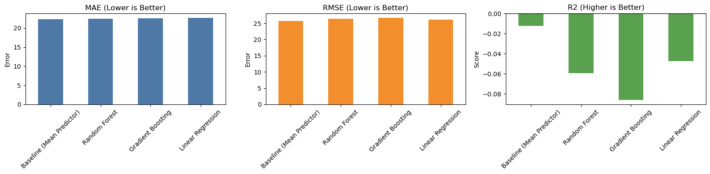
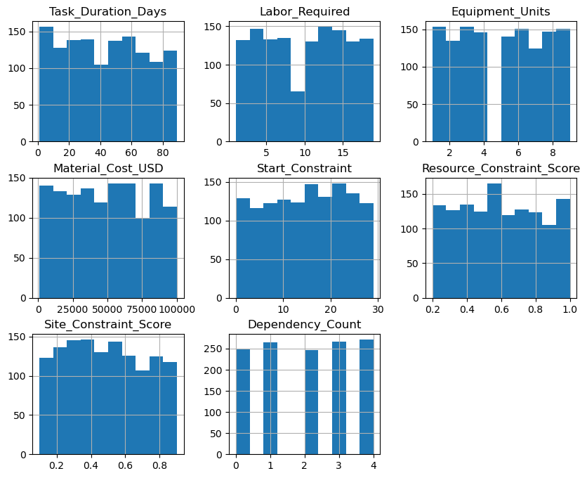
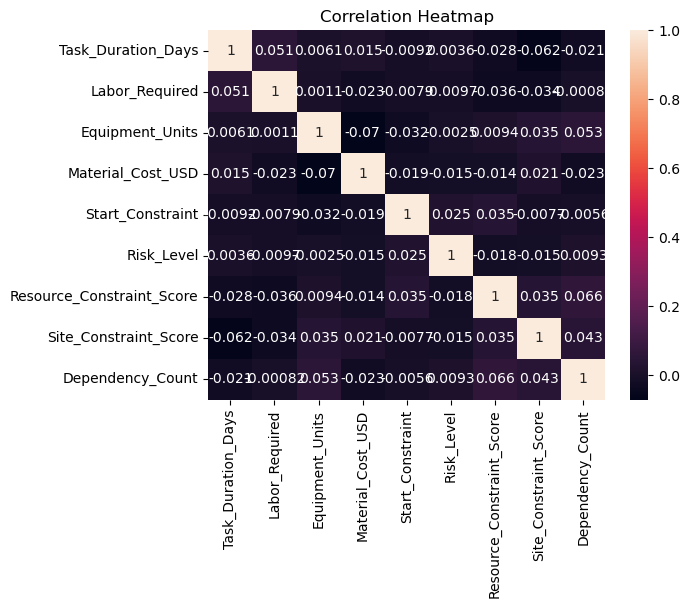
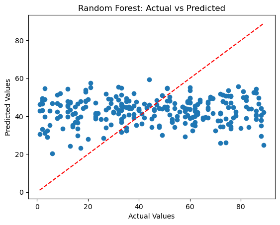
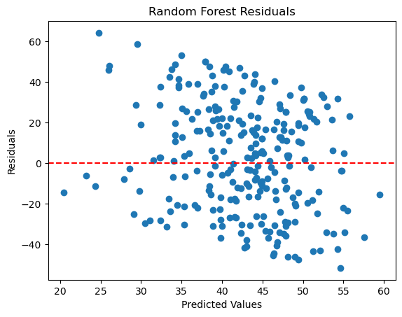

# Construction Project Management ML

End-to-end applied data science project focused on predicting construction task duration (`Task_Duration_Days`) from cost, labor, equipment, risk, and constraint features.

## Executive Summary
- Framed a supervised regression problem for schedule-duration prediction in a construction context.
- Built and compared 3 models: Linear Regression, Random Forest, and Gradient Boosting.
- Engineered domain-relevant predictors to test whether constraint and risk interactions improved signal.
- Used cross-validation and held-out test evaluation with MAE, RMSE, and R2.
- Benchmarked against a naive baseline (`DummyRegressor`, mean strategy) to validate real model value.
- Key result: all trained models underperformed baseline, indicating limited predictive signal in the current feature space.

This project demonstrates core Data Science competencies: problem framing, feature design, model benchmarking, diagnostic analysis, and communicating statistically grounded conclusions (including negative results).

## Business Question
Can we accurately predict `Task_Duration_Days` early enough to improve construction planning and resource allocation?

## Data Science Focus
- Structured experimentation: compare linear and nonlinear models under a consistent evaluation protocol.
- Error-centric evaluation: prioritize MAE/RMSE for operational relevance, with R2 for explained variance.
- Baseline-first methodology: verify whether model complexity adds measurable value.
- Diagnostic reasoning: use residual behavior and prediction plots to identify underfitting/missed structure.

## Tech Stack
- Python
- pandas, NumPy
- scikit-learn
- matplotlib, seaborn
- Jupyter Notebook

## Dataset
- File: `Data/construction_dataset.csv`
- Target: `Task_Duration_Days`
- Core predictors used:
  - `Material_Cost_USD`, `Labor_Required`, `Equipment_Units`
  - `Start_Constraint`, `Dependency_Count`
  - `Risk_Level`, `Resource_Constraint_Score`, `Site_Constraint_Score`

## Methodology
### Data Preparation
- Removed missing rows with `dropna()`.
- Encoded `Risk_Level` from categorical to ordinal values:
  - Low -> 1
  - Medium -> 2
  - High -> 3
- Removed `Task_ID` (identifier only).

### Feature Engineering
- `Total_Constraint_Score = Resource_Constraint_Score + Site_Constraint_Score`
- `Cost_Per_Labor = Material_Cost_USD / Labor_Required + 1`
- `Weighted_Risk = Total_Constraint_Score * Risk_Level`

### Modeling and Validation
- Train/test split: 80/20 (`random_state=13`)
- 5-fold cross-validation using MAE
- Models:
  - Linear Regression (scaled features)
  - Random Forest Regressor
  - Gradient Boosting Regressor
- Final comparison against a baseline mean predictor

Evaluation rationale:
- MAE: interpretable average error in days.
- RMSE: stronger penalty for large misses.
- R2: explanatory power relative to mean-prediction baseline.

## Results
### Cross-Validation MAE (5-fold)
- Linear Regression: `22.3687`
- Random Forest: `22.2910`
- Gradient Boosting: `22.7203`

### Test Set Metrics
| Model | MAE | RMSE | R2 |
|---|---:|---:|---:|
| Baseline (Mean Predictor) | 22.3717 | 25.7389 | -0.0124 |
| Random Forest | 22.4473 | 26.3328 | -0.0597 |
| Linear Regression | 22.6606 | 26.1817 | -0.0475 |
| Gradient Boosting | 22.5793 | 26.6614 | -0.0863 |

### Interpretation
- No model achieved positive `R2`.
- All three trained models were worse than the baseline on MAE and RMSE.
- Current feature set/model setup is not sufficient for production-quality prediction.

Data science takeaway:
- This is a validated null-result scenario. The experiment design prevented false confidence by using baseline benchmarking and multiple metrics.
- The evidence suggests the need for richer explanatory variables, not just more complex algorithms.

## Key Visuals
### Model Comparison (Most Important)

Why this matters: this single chart summarizes the decision outcome and shows that model complexity did not beat a naive baseline.

### Data Understanding

Why this matters: reveals skew and spread in predictors, which informs transformations and robust modeling choices.

Why this matters: highlights linear relationships and potential multicollinearity.

### Example Diagnostics (Random Forest)

Why this matters: broad scatter away from the diagonal reflects weak predictive fit.

Why this matters: residual spread indicates unmodeled structure remains.

## What I Would Improve Next
1. Add richer domain features (weather, subcontractor reliability, permit delays, project phase complexity).
2. Run systematic hyperparameter tuning (`RandomizedSearchCV`) with nested validation.
3. Test robust target/feature transforms for skew and heavy tails.
4. Validate with repeated CV and, if appropriate, time-aware splits.
5. Add error slicing by project characteristics to identify segment-level signal.

## Skills Demonstrated
- Supervised regression modeling in Python (`scikit-learn`)
- Feature engineering from domain context
- Cross-validation and holdout-based model assessment
- Baseline benchmarking and model selection logic
- Residual diagnostics and interpretation
- Clear communication of findings for technical and business stakeholders

## Repository Structure
- `eda.ipynb`: full analysis, modeling, diagnostics, and baseline comparison
- `Data/construction_dataset.csv`: input data
- `images/`: plots exported from notebook outputs

## Reproducibility
1. Open `eda.ipynb`.
2. Run cells top-to-bottom.
3. Review metrics and plots in the final evaluation sections.
